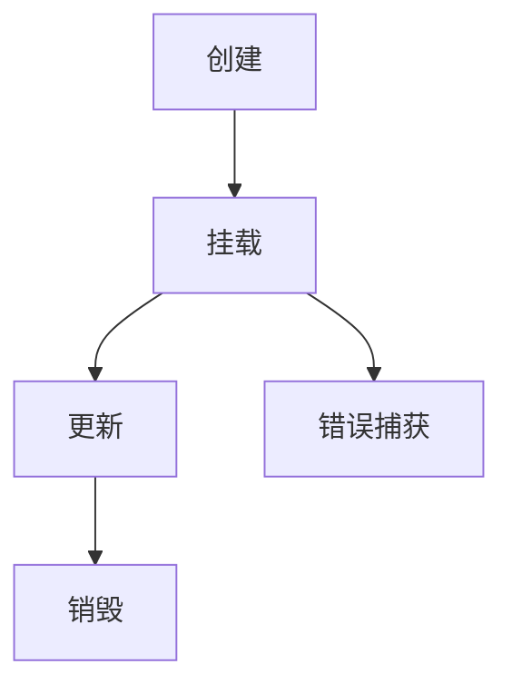

# 组件基础

## 什么是组件？

组件 (Component) 是 Vue.js 最强大的功能之一。组件可以扩展 HTML 元素，封装可重用的代码。在较高层面上，组件是自定义元素，Vue.js 的编译器会为其添加特殊功能。在有些情况下，组件也可以是原生 HTML 元素的形式，以 `is` attribute 扩展。

## 组件注册

### 全局注册

我们可以使用 `app.component()` 方法，让组件在当前 Vue 应用中全局可用：

```javascript
const app = Vue.createApp({})

app.component('my-component-name', {
  // ... 选项 ...
})
```

全局注册的组件可以在任意组件的模板中使用。

### 局部注册

全局注册虽然很方便，但有以下几个问题：

1. 即使不再使用某个组件，它仍然会包含在最终的构建产物中（这被称为"代码死区")
2. 在大型项目中，使得依赖关系变得不那么明确
3. 可能与其他开发人员的组件命名冲突

局部注册将组件的作用域限定在另一个组件内部。这使得依赖关系更加明确，并且对树摇优化 (tree-shaking) 更加友好。

```javascript
const ComponentA = {
  // ... 选项 ...
}

const ComponentB = {
  // ... 选项 ...
}

const app = Vue.createApp({
  components: {
    'component-a': ComponentA,
    'component-b': ComponentB
  }
})
```

## 组件命名约定

在注册组件时，我们始终需要给它一个名字。组件名有两种命名方式：

### 使用 kebab-case

```javascript
app.component('my-component-name', {
  // ...
})
```

当使用 kebab-case (短横线分隔命名) 定义一个组件时，你在引用这个自定义元素时也必须使用 kebab-case，例如 `<my-component-name>`。

### 使用 PascalCase

```javascript
app.component('MyComponentName', {
  // ...
})
```

当使用 PascalCase (首字母大写命名) 定义一个组件时，你在引用这个自定义元素时两种命名法都可以使用。这也就是说 `<my-component-name>` 和 `<MyComponentName>` 都是可以接受的。注意，尽管如此，在 DOM (即非字符串的模板) 中只有 kebab-case 是有效的。

::: tip 最佳实践
我们推荐使用 PascalCase 在模板中命名组件，因为：

1. PascalCase 在 JavaScript 中更常见
2. 在字符串模板中，PascalCase 保持了组件名的可读性
3. 编辑器可以在字符串模板中提供更好的自动补全
4. 这与你在 JavaScript 中看到的几乎所有其他东西相匹配
:::

## 组件的组织结构

### 单文件组件

在很多 Vue 项目中，我们使用类似 HTML 的语法来定义组件，这种文件被称为**单文件组件** (也称 `*.vue` 文件，英文 Single-File Component，缩写为 SFC)：

```vue
<template>
  <div class="example">{{ msg }}</div>
</template>

<script>
export default {
  data() {
    return {
      msg: 'Hello world!'
    }
  }
}
</script>

<style scoped>
.example {
  color: red;
}
</style>
```

单文件组件是 Vue 生态系统中的一个重要创新。如果你还没有听说过，别担心，我们会在后面详细讨论。

### 组件选项

组件的定义通常包含以下选项：

- `template`: 组件的模板
- `script`: 组件的逻辑 (data, methods, computed, watch, lifecycle hooks 等)
- `style`: 组件的样式

## 组件的 data 选项

当我们定义一个 `<button-counter>` 组件时，你可能会发现它的 `data` 选项并不是一个简单的对象，而是一个函数：

```javascript
Vue.createApp({
  data() {
    return {
      count: 0
    }
  }
})
```

如果你在组件中仍然使用纯对象：

```javascript
Vue.createApp({
  data: {
    count: 0
  }
})
```

那么所有该组件的实例将**共享同一个 `data` 对象**！这不是我们想要的。相反，我们希望每个组件实例都有自己独立的数据副本。因此，我们需要将 `data` 定义为一个返回初始数据对象的函数。

## 组件的生命周期

每个 Vue 组件实例在创建时都要经历一系列的初始化步骤。例如，它需要设置数据监听、编译模板、挂载实例到 DOM，以及在数据改变时更新 DOM。在此过程中，它也会运行被称为生命周期钩子的函数，让开发者有机会在特定阶段添加自己的代码。

### 生命周期图示



### 生命周期钩子

所有的生命周期钩子函数都会自动绑定 `this` 上下文到实例中，所以你可以访问数据，对 property 和方法进行运算。这意味着**你不能使用箭头函数来定义一个生命周期方法** (例如 `created: () => this.fetchTodos()`)。这是因为箭头函数没有自己的 `this` 上下文。

#### 创建阶段

- `beforeCreate`: 在实例初始化之后、进行数据观测和事件配置之前被调用
- `created`: 在实例创建完成后被立即调用

```javascript
export default {
  beforeCreate() {
    console.log('Component is about to be created')
    // 此时 data 和 methods 还未初始化
  },
  created() {
    console.log('Component has been created')
    // 可以访问 data 和 methods
    // 适合发送 HTTP 请求、初始化数据
  }
}
```

#### 挂载阶段

- `beforeMount`: 在挂载开始之前被调用
- `mounted`: 实例被挂载后调用

```javascript
export default {
  beforeMount() {
    console.log('Component is about to be mounted')
    // 模板已编译，但还未渲染到 DOM
  },
  mounted() {
    console.log('Component has been mounted')
    // 可以访问 DOM 元素
    // 适合操作 DOM、设置定时器、监听事件
  }
}
```

#### 更新阶段

- `beforeUpdate`: 数据更新时调用，发生在虚拟 DOM 打补丁之前
- `updated`: 由于数据更改导致的虚拟 DOM 重新渲染和打补丁，在这之后会调用该钩子

```javascript
export default {
  beforeUpdate() {
    console.log('Component is about to update')
    // 数据已改变，但 DOM 还未更新
  },
  updated() {
    console.log('Component has been updated')
    // DOM 已更新
    // 适合基于更新后的 DOM 进行操作
  }
}
```

#### 销毁阶段

- `beforeUnmount`: 实例销毁之前调用
- `unmounted`: 实例销毁后调用

```javascript
export default {
  beforeUnmount() {
    console.log('Component is about to be unmounted')
    // 组件仍完全可用
  },
  unmounted() {
    console.log('Component has been unmounted')
    // 清理工作：移除事件监听器、定时器等
  }
}
```

#### 错误捕获

- `errorCaptured`: 当捕获一个来自子孙组件的错误时被调用

```javascript
export default {
  errorCaptured(err, instance, info) {
    // 处理错误
    console.error('Error captured:', err, info)
    // 返回 false 以阻止错误继续向上传播
    return false
  }
}
```

## 组件间通信

### 父组件向子组件传递数据

在 Vue 中，父子组件的关系可以总结为：**props down, events up**。父组件通过 **props** 向下传递数据给子组件，子组件通过 **events** 向上传递信息给父组件。

### Props

Props 是你可以在组件上注册的一些自定义 attribute。当一个值传递给一个 prop attribute 的时候，它就变成了那个组件实例的一个 property。

```javascript
// 子组件
const BlogPost = {
  props: ['title'],
  template: `<h4>{{ title }}</h4>`
}

// 父组件
const app = Vue.createApp({
  components: {
    BlogPost
  },
  template: `
    <div>
      <blog-post title="My journey with Vue"></blog-post>
      <blog-post title="Blogging with Vue"></blog-post>
      <blog-post title="Why Vue is so fun"></blog-post>
    </div>
  `
})
```

### Events

我们知道组件实例的作用域是孤立的。这意味着父组件的数据不能在子组件的模板中直接使用。要让子组件修改父组件的数据，我们需要通过事件来实现。

在子组件中，我们可以调用 `$emit` 方法并传入事件名称来触发一个事件：

```javascript
const BlogPost = {
  props: ['title'],
  template: `
    <div class="blog-post">
      <h4>{{ title }}</h4>
      <button @click="$emit('enlarge-text')">
        Enlarge text
      </button>
    </div>
  `
}
```

然后父组件可以像处理原生 DOM 事件一样监听这个事件：

```javascript
app.component('blog-post', BlogPost)

const app = Vue.createApp({
  template: `
    <div>
      <blog-post
        v-for="post in posts"
        :key="post.id"
        :title="post.title"
        @enlarge-text="postFontSize += 0.1"
      ></blog-post>
    </div>
  `
})
```

## 组件的组织方式

### 组件文件夹结构

```
src/
  components/
    BaseButton.vue
    BaseInput.vue
    BaseSelect.vue
    ui/
      ButtonGroup.vue
      Modal.vue
    business/
      UserProfile.vue
      ProductCard.vue
```

### 组件命名约定

- **基础组件**: `BaseButton`, `BaseInput`, `BaseSelect`
- **页面组件**: `HomePage`, `UserProfile`, `ProductList`
- **业务组件**: `UserCard`, `ProductForm`, `OrderSummary`
- **布局组件**: `AppHeader`, `AppSidebar`, `AppFooter`

### 组件导出方式

```javascript
// components/index.js
export { default as BaseButton } from './BaseButton.vue'
export { default as BaseInput } from './BaseInput.vue'
export { default as BaseSelect } from './BaseSelect.vue'
```

```javascript
// main.js
import { BaseButton, BaseInput, BaseSelect } from '@/components'
```

## 最佳实践

### 组件设计原则

1. **单一职责**: 每个组件应该只负责一个功能
2. **可复用性**: 设计时考虑组件的通用性
3. **可维护性**: 组件内部逻辑清晰，易于理解
4. **可测试性**: 组件功能独立，便于单元测试

### Props 设计

```javascript
// 推荐的 props 定义方式
export default {
  props: {
    // 基础类型检查
    title: String,
    likes: Number,
    isPublished: Boolean,
    commentIds: Array,
    author: Object,

    // 带默认值的对象
    options: {
      type: Object,
      default() {
        return { message: 'hello' }
      }
    },

    // 自定义验证函数
    propE: {
      type: String,
      validator(value) {
        return ['success', 'warning', 'danger'].includes(value)
      }
    },

    // 必需的字符串
    propF: {
      type: String,
      required: true
    }
  }
}
```

### 组件注册策略

```javascript
// 全局注册常用基础组件
const app = Vue.createApp(App)

// 注册全局组件
app.component('BaseButton', BaseButton)
app.component('BaseInput', BaseInput)
app.component('BaseSelect', BaseSelect)

// 局部注册页面特定组件
import UserCard from './components/UserCard.vue'
import ProductList from './components/ProductList.vue'

export default {
  components: {
    UserCard,
    ProductList
  }
}
```

### 组件通信模式

#### 父子通信

```javascript
// 父组件
<template>
  <child-component
    :message="parentMessage"
    @update-message="handleUpdate"
  />
</template>

<script>
export default {
  data() {
    return {
      parentMessage: 'Hello from parent'
    }
  },
  methods: {
    handleUpdate(newMessage) {
      this.parentMessage = newMessage
    }
  }
}
</script>
```

```javascript
// 子组件
<template>
  <div>
    <p>{{ message }}</p>
    <button @click="$emit('update-message', 'Hello from child')">
      Update
    </button>
  </div>
</template>

<script>
export default {
  props: ['message'],
  emits: ['update-message']
}
</script>
```

#### 兄弟组件通信

```javascript
// 使用事件总线
// eventBus.js
import { createApp } from 'vue'

const eventBus = createApp({}).config.globalProperties.$eventBus = {}

export default eventBus

// 组件A
import eventBus from './eventBus'

export default {
  methods: {
    sendMessage() {
      eventBus.$emit('message-sent', 'Hello from A')
    }
  }
}

// 组件B
import eventBus from './eventBus'

export default {
  mounted() {
    eventBus.$on('message-sent', this.handleMessage)
  },
  beforeUnmount() {
    eventBus.$off('message-sent', this.handleMessage)
  },
  methods: {
    handleMessage(message) {
      console.log(message)
    }
  }
}
```

### 性能优化

#### 函数式组件

对于一些纯展示组件，可以使用函数式组件来提升性能：

```javascript
// 函数式组件
const FunctionalComponent = {
  functional: true,
  props: ['message'],
  render(h, context) {
    return h('div', context.props.message)
  }
}
```

#### 异步组件

对于大型组件，可以使用异步组件来实现代码分割：

```javascript
const AsyncComponent = () => import('./AsyncComponent.vue')

export default {
  components: {
    AsyncComponent
  }
}
```

::: warning 注意事项
- 组件的 data 必须是函数
- 生命周期钩子中不要使用箭头函数
- Props 是单向的，不要在子组件中修改 props
- 组件销毁时要清理事件监听器和定时器
- 合理使用组件注册策略，避免全局污染
:::


